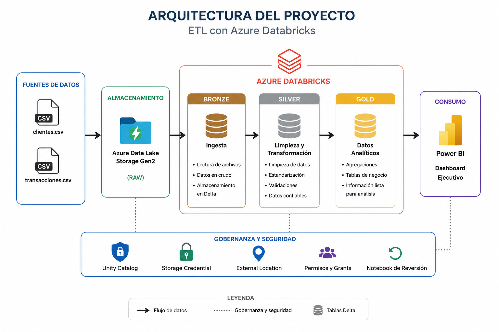
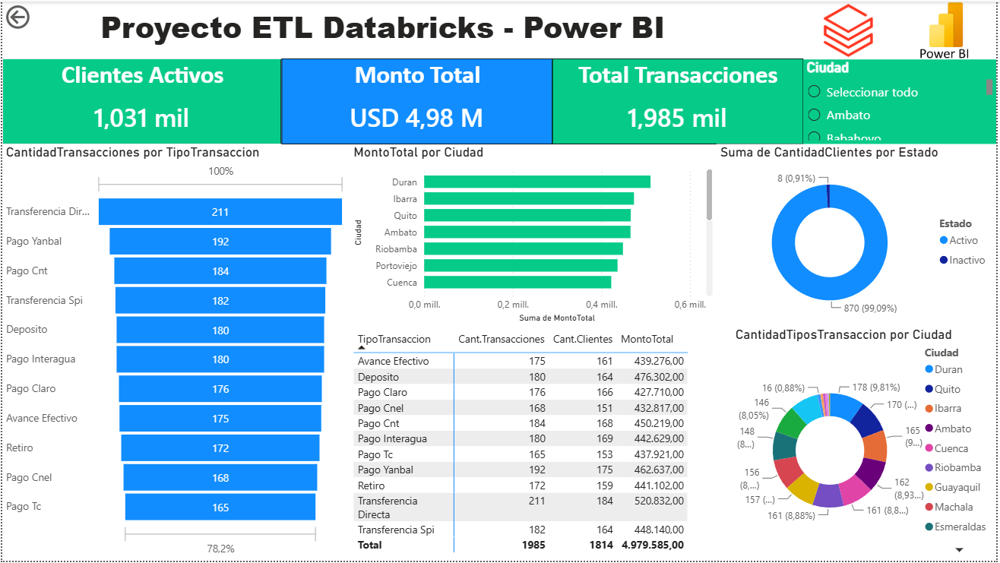
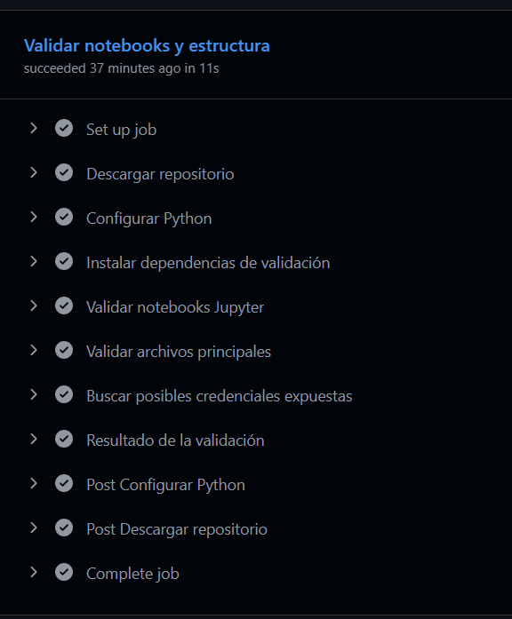

# 🚀 Proyecto Final - ETL con Azure Databricks

Proyecto desarrollado como parte del curso de **Ingeniería de Datos**, implementando un pipeline ETL con **Azure Databricks**, **PySpark**, **Delta Lake**, **Unity Catalog** y **Power BI**, siguiendo la arquitectura **Medallion (Bronze, Silver y Gold)**.

---

## 📖 Descripción

Este proyecto implementa un proceso ETL completo para transformar datos transaccionales almacenados en archivos CSV dentro de Azure Data Lake Storage Gen2.

El procesamiento se realiza utilizando Azure Databricks, aplicando la arquitectura Medallion para obtener información analítica que posteriormente es consumida mediante un Dashboard Ejecutivo desarrollado en Power BI.

---

## 🏗 Arquitectura del Proyecto

<p align="center">

</p>
---

# 🛠️ Tecnologías Utilizadas

| Tecnología | Uso en el Proyecto |
|------------|--------------------|
| Azure Databricks | Procesamiento y transformación de datos |
| Apache Spark (PySpark) | Motor de procesamiento distribuido |
| Delta Lake | Almacenamiento de tablas Delta |
| Azure Data Lake Storage Gen2 | Almacenamiento de archivos CSV (Raw) |
| Unity Catalog | Gobierno y administración de metadatos |
| SQL | Consultas y transformaciones |
| Python | Desarrollo de notebooks ETL |
| Power BI Desktop | Visualización y análisis de datos |
| GitHub | Control de versiones |
| GitHub Actions | Workflow de Integración Continua (CI) |

---

# 📂 Estructura del Proyecto

```text
Proyecto_Final_Databricks_MME_2026/
│
├── .github/
│   └── workflows/
│       └── ci_databricks.yml
│
├── preamb/
│   ├── 00_Catalog.ipynb
│   ├── 01_UnityCatalog.ipynb
│   ├── 02_ExternalLocation.ipynb
│   └── 03_Schemas.ipynb
│
├── proceso/
│   ├── 01_Bronze.ipynb
│   ├── 02_Silver.ipynb
│   └── 03_Gold.ipynb
│
├── seguridad/
│   └── grant.ipynb
│
├── reversion/
│   └── drop_tablas.ipynb
│
├── dashboard/
│   ├── Proyecto_ETL_Dashboard.pbix
│   └── dashboard.png
│
├── datasets/
│   ├── clientes.csv
│   └── transacciones.csv
│
├── evidencias/
│   ├── arquitectura.png
│   ├── workflow.png
│   └── capturas/
│
└── README.md
```

---

# 🔄 Flujo ETL

El proyecto implementa la arquitectura **Medallion**, organizando el procesamiento de datos en tres capas:

### 🥉 Bronze

- Ingesta de archivos CSV desde Azure Data Lake Storage Gen2.
- Lectura de datos mediante PySpark.
- Almacenamiento en formato Delta sin modificaciones.

### 🥈 Silver

- Limpieza y validación de los datos.
- Estandarización de columnas.
- Corrección de formatos y codificación.
- Eliminación de registros inconsistentes.

### 🥇 Gold

- Construcción de tablas analíticas.
- Generación de indicadores (KPIs).
- Resúmenes por ciudad, cliente, estado y tipo de transacción.
- Preparación de la información para consumo en Power BI.
---

# 🥇 Modelo Analítico - Capa Gold

La capa **Gold** contiene las tablas analíticas listas para el consumo de herramientas de Business Intelligence. Estas tablas fueron utilizadas como fuente de datos para el Dashboard Ejecutivo desarrollado en Power BI.

| Tabla | Descripción |
|--------|-------------|
| **detalle_transacciones** | Contiene el detalle de todas las transacciones procesadas. |
| **kpi_ejecutivo** | Tabla con los principales indicadores ejecutivos del proyecto. |
| **ranking_clientes** | Ranking de clientes según el número de transacciones y monto total. |
| **resumen_cliente** | Información consolidada por cliente. |
| **resumen_ciudad** | Resumen de transacciones agrupadas por ciudad. |
| **resumen_estado** | Resumen de clientes activos e inactivos. |
| **resumen_tipo_transaccion** | Resumen por tipo de transacción. |

---

# 📊 Dashboard Ejecutivo (Power BI)

El Dashboard fue desarrollado utilizando **Power BI Desktop**, conectado directamente a las tablas de la capa **Gold** almacenadas en Azure Databricks mediante un **SQL Warehouse**.

### Principales indicadores

- 👥 Clientes Activos
- 💰 Monto Total Transaccionado
- 🔄 Total de Transacciones

### Visualizaciones

- 📈 Cantidad de Transacciones por Tipo
- 🌎 Monto Total por Ciudad
- 🟢 Estado de Clientes (Activo / Inactivo)
- 🏆 Ranking de Clientes

<p align="center">
    
</p>

---

# 🔄 Workflow CI (GitHub Actions)

Como parte del proyecto se implementó un flujo de **Integración Continua (CI)** utilizando **GitHub Actions**, permitiendo validar automáticamente la estructura del repositorio y los notebooks cada vez que se realiza un cambio.

### Validaciones implementadas

- ✅ Validación de notebooks Jupyter (.ipynb).
- ✅ Verificación de la estructura del proyecto.
- ✅ Validación del archivo README.
- ✅ Detección de posibles credenciales expuestas.

<p align="center">
    
</p>
